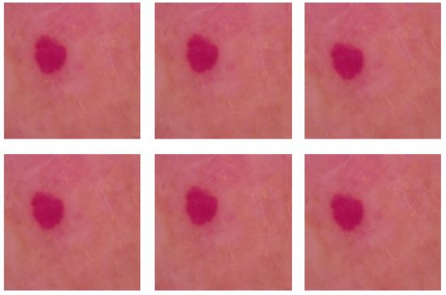
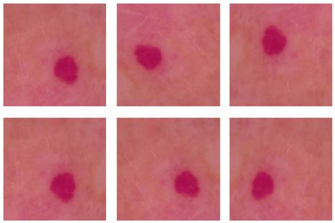
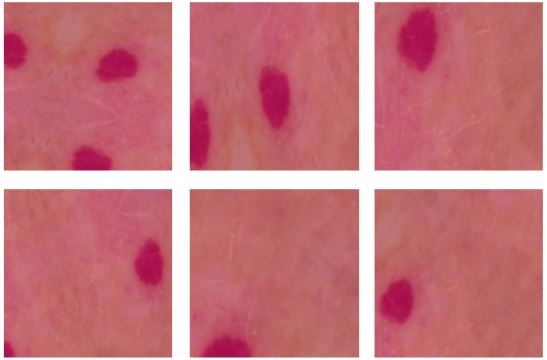

# Training steps

- Training will be splitted into 3 different stages
- Every stage would have different parameters of data augmentation and layers trainable
- Code examples shown the process with ResNet50

# 1st stage

- **Data Augmentation:**
```
train_datagen = tf.keras.preprocessing.image.ImageDataGenerator(
                                  rescale=1./255.,
                                  rotation_range = 10,
                                  )
```
- **Results of DA:**



- **Base Model:**
```
base_model = tf.keras.applications.ResNet50V2(input_shape=(SIZE,SIZE, 3),
                                                include_top=False,
                                                weights='imagenet')   
base_model.trainable = False

modelo = tf.keras.Sequential([
        base_model,
        tf.keras.layers.GlobalAveragePooling2D(),
        tf.keras.layers.Dense(128, activation='relu', kernel_initializer='he_uniform'),
        tf.keras.layers.Dropout(0.2),
        tf.keras.layers.Dense(64, activation='relu', kernel_initializer='he_uniform'),
        tf.keras.layers.Dropout(0.1),
        tf.keras.layers.Dense(32, activation='relu', kernel_initializer='he_uniform'),
        tf.keras.layers.Dropout(0.1),
        tf.keras.layers.Dense(7, activation='softmax')
    ])
```
# 2nd stage

- **Data Augmentation:**
```
train_datagen = tf.keras.preprocessing.image.ImageDataGenerator(
                                  rescale=1./255.,
                                  rotation_range = 20,
                                  width_shift_range = 0.2,
                                  height_shift_range = 0.2,
                                  zoom_range = 0.1,
                                  horizontal_flip = True,
                                  vertical_flip = True,
                                  fill_mode = 'nearest'
                                  )
```
- **Results of DA:**



- **Base Model:**
```
# Load weights from previous stage
new_model = tf.keras.models.load_model(os.path.join(dir_modelos, "ResNet1.h5"))
weights = new_model.get_weights()

base_model = tf.keras.applications.ResNet50V2(input_shape=(SIZE,SIZE, 3),
                                                include_top=False,
                                                weights='imagenet') 

fine_tune_at = 164

# Freeze all the layers before the `fine_tune_at` layer
for layer in base_model.layers[:fine_tune_at]:
  layer.trainable = False

modelo = tf.keras.Sequential([
        base_model,
        tf.keras.layers.GlobalAveragePooling2D(),
        tf.keras.layers.Dense(128, activation='relu', kernel_initializer='he_uniform'),
        tf.keras.layers.Dropout(0.2),
        tf.keras.layers.Dense(64, activation='relu', kernel_initializer='he_uniform'),
        tf.keras.layers.Dropout(0.1),
        tf.keras.layers.Dense(32, activation='relu', kernel_initializer='he_uniform'),
        tf.keras.layers.Dropout(0.1),
        tf.keras.layers.Dense(7, activation='softmax')
    ])

# Use weights from previous stage
modelo.set_weights(weights)
```


# 3rd stage

- **Data Augmentation:**
```
train_datagen = tf.keras.preprocessing.image.ImageDataGenerator(
                                  rescale=1./255.,
                                  rotation_range = 60,
                                  width_shift_range = 0.5,
                                  height_shift_range = 0.4,
                                  channel_shift_range = 0.5,
                                  zoom_range = 0.4,
                                  shear_range=0.5,
                                  horizontal_flip = True,
                                  vertical_flip = True,
                                  fill_mode = 'reflect'
                                  )
```
- **Results of DA:**



- **Base Model:**
```
# Load weights from previous stage
new_model = tf.keras.models.load_model(os.path.join(dir_modelos, "ResNet2.h5"))
weights = new_model.get_weights()

base_model = tf.keras.applications.ResNet50V2(input_shape=(SIZE,SIZE, 3),
                                                include_top=False,
                                                weights='imagenet') 

fine_tune_at = 164

# Freeze all the layers before the `fine_tune_at` layer
for layer in base_model.layers[:fine_tune_at]:
  layer.trainable = False

modelo = tf.keras.Sequential([
        base_model,
        tf.keras.layers.GlobalAveragePooling2D(),
        tf.keras.layers.Dense(128, activation='relu', kernel_initializer='he_uniform'),
        tf.keras.layers.Dropout(0.2),
        tf.keras.layers.Dense(64, activation='relu', kernel_initializer='he_uniform'),
        tf.keras.layers.Dropout(0.1),
        tf.keras.layers.Dense(32, activation='relu', kernel_initializer='he_uniform'),
        tf.keras.layers.Dropout(0.1),
        tf.keras.layers.Dense(7, activation='softmax')
    ])

# Use weights from previous stage
modelo.set_weights(weights)
```


