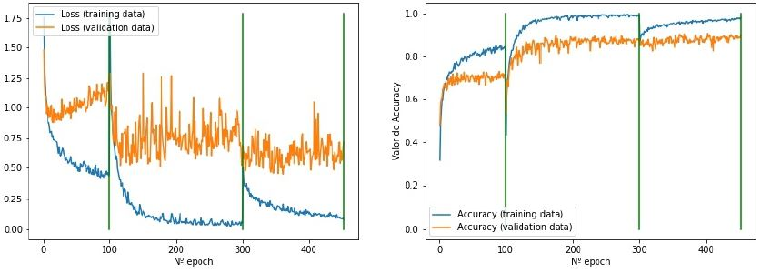
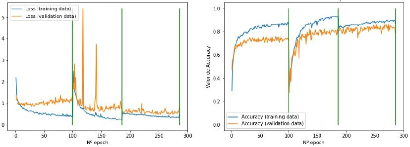
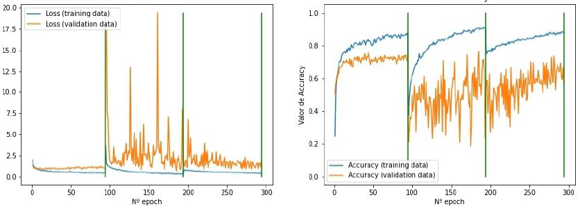

# Convolutional Neural Networks

Regarding visual pattern recognition, Kunihiko Fukushima presented in 1980 the "Neocognitron" [1], a model capable of recognizing similarities in geometric shapes without without being affected by their position. This model was developed into a larger scale network by Fukushima himself, Sei Miyake and Takayuri Ito in 1983 [2], as shown in the following figure. The depth of the networks, and their training, was limited by the existing techniques at that time.

In 1985, David E. Rumelhart, Geoffrey E. Hinton and Ronald J. Williams performed the practical demonstration of the backpropagation algorithm [3] [4], which made possible to train multilayer neural networks with supervision.

This breakthrough led Yann LeCun and his team at the AT&T Bell Labs to present the first Convolutional Neural Network in history (1989), called LeNet-5, training trained by means of this algorithm for the recognition of handwritten digits [5]. Its architecture is shown in the figure.

In Convolutional Neural Networks two main stages are distinguished, feature extraction and feature transformation. For feature extraction, convolution and pooling layers are used, dense layers are used for transformation. Since the convolution layer seeks to extract features, its output are referred as "feature maps". The pooling layer allows to provide some invariance to small deformations of the features, by reducing the size of the data by taking some representative value of a region. Then, in the transformation stage, the "feature maps" are classified at the output of the last convolution layer, by a classic dense layer [6].

**References:**

[1] Kunihiko Fukushima. “Neocognitron: A self-organizing neural network model for a mechanism
of pattern recognition unaffected by shift in position”. En: Biological Cybernetics 36.4 (1980),
pags. 193-202. doi: 10.1007/bf00344251. url: https://doi.org/10.1007%2Fbf00344251.

[2] Kunihiko Fukushima, Sei Miyake y Takayuki Ito. “Neocognitron: A neural network model
for a mechanism of visual pattern recognition”. En: IEEE Transactions on Systems, Man,
and Cybernetics SMC-13.5 (1983), pags. 826-834. doi: 10.1109/TSMC.1983.6313076.

[3] David E Rumelhart, Geoffrey E Hinton y Ronald J Williams. "Learning internal representations
by error propagation". Inf. tec. California Univ San Diego La Jolla Inst for Cognitive Science,
1985.

[4] David E Rumelhart, Geoffrey E Hinton y Ronald J Williams. “Learning representations by
back-propagating errors”. En: nature 323.6088 (1986), pags. 533-536.

[5] Y. Lecun y col. “Gradient-based learning applied to document recognition”. En: Proceedings
of the IEEE 86.11 (1998), p´ags. 2278-2324. doi: 10.1109/5.726791.

[6] Manuel Emilio Gegúndez Arias. Deep Learning. spa. Univerdidad de Huelva, 2021.
isbn: 9788418628290.
## Architectures used

**Xception**
Xception was presented by Google in 2017 [7], as an evolution of the Inception model. It is a deep network of separable convolutional layers (skip connections), as shown in the figure, with which excellent results have been obtained.

**ResNet**
The ResNet model was proposed [8] and later improved [9], by Microsoft. In the implementation, a residual mechanism was developed, which allowed a very deep network to be created without increasing the classification error. The initial proposal and the improvement are shown in the figure.

**MobileNet**
MobileNet was introduced in 2017 by Google [10]. It has an architecture of separable convolutional layers, shown in the figure. The design has features hyperparameters that allow the model builder to choose the appropriate size to meet the needs of the problem.

[7] Francois Chollet. “Xception: Deep Learning with Depthwise Separable Convolutions”. En:
(2016). doi: 10.48550/ARXIV.1610.02357. url: https://arxiv.org/abs/1610.02357.

[8] Kaiming He y col. “Deep Residual Learning for Image Recognition”. En: (2015). doi: 10.
48550/ARXIV.1512.03385. url: https://arxiv.org/abs/1512.03385.

[9] Kaiming He y col. “Identity Mappings in Deep Residual Networks”. En: (2016). doi: 10.
48550/ARXIV.1603.05027. url: https://arxiv.org/abs/1603.05027.

[10] Andrew G. Howard y col. “MobileNets: Efficient Convolutional Neural Networks for Mobile
Vision Applications”. En: (2017). doi: 10.48550/ARXIV.1704.04861. url: https://arxiv.
org/abs/1704.04861.

## Training stages Xception

## Training stages ResNet

## Training stages MobileNet

