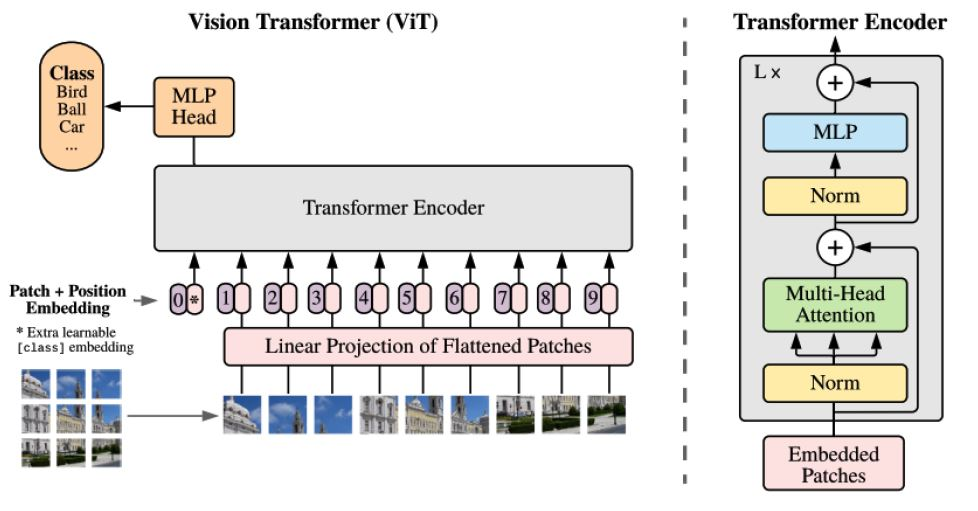
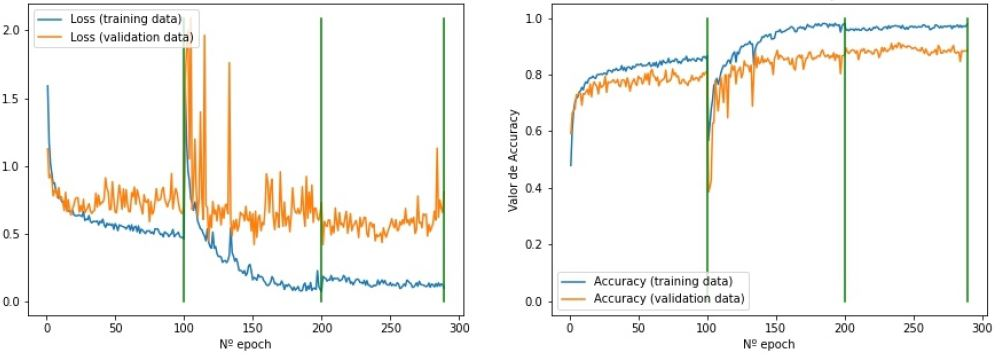
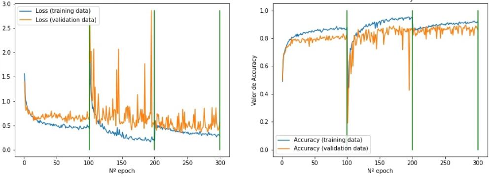
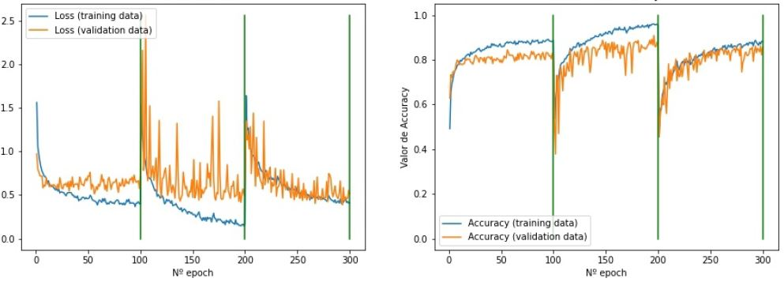

# Vision Transformers

Transformers emerges as an alternative to classical neural networks used in natural language processing and recurrent tasks. It was presented in 2017 by Google, and its main contribution is the "Attention Mechanism"[1]. Based on
this technology, models have been developed with excellent results in text-related tasks such as: translation, comprehension and answering of questions, elaboration of summaries, and instructions generation.

Motivated by the success of the Transformers models in text processing, the technology continued to be developed for application in other fields, resulting in the introduction of the **Vision Transformers** in 2020 [2]. This architecture optimizes the use of memory in training, due to its parallelizable design. As a result, it reduces the time required for the adjustment of parameters in the networks.

The **Vision Transformers** models, as shown in the figure, are divided into three fundamental stages. In the first, known as "Patch Embedding", the input image is divided into small sections called patches. Each patch contains its encoded position in the image, assigned by the embedder, for that reason, the order in which it enters the network can vary without influencing the classification. In addition, a token is added to each image, which occupies the zero position in the input to the second stage. In the "Transformer Encoder", the "Attention Mechanism" is applied to the relationships between the pixels of the patches, and the output is generated and connected to the third stage, where the classification is performed with classic dense layers [2].

**References:**

[1] Ashish Vaswani y col. “Attention Is All You Need”. En: CoRR abs/1706.03762 (2017). arXiv:
1706.03762. url: http://arxiv.org/abs/1706.03762.

[2] Alexey Dosovitskiy y col. “An Image isWorth 16x16Words: Transformers for Image Recognition
at Scale”. En: CoRR abs/2010.11929 (2020). arXiv: 2010.11929. url: https://arxiv.org/
abs/2010.11929.

## Architectures used

Due to the recentness of the Vision Transformers technology, few researches with solutions of this type have been documented to date, and not so many architectures have been developed. The models with the best known results are the B-16, B-32, L-16 and L-32. The letter B indicates that it was trained with the ImageNet-21K dataset, and the letter L indicates that after the first training, a fine tuning was performed with the ImageNet-2012 dataset. The number accompanying the letter is the size of the patch used by the model.

## Training stages ViT - B32

## Training stages ViT - B16

## Training stages ViT - L32

