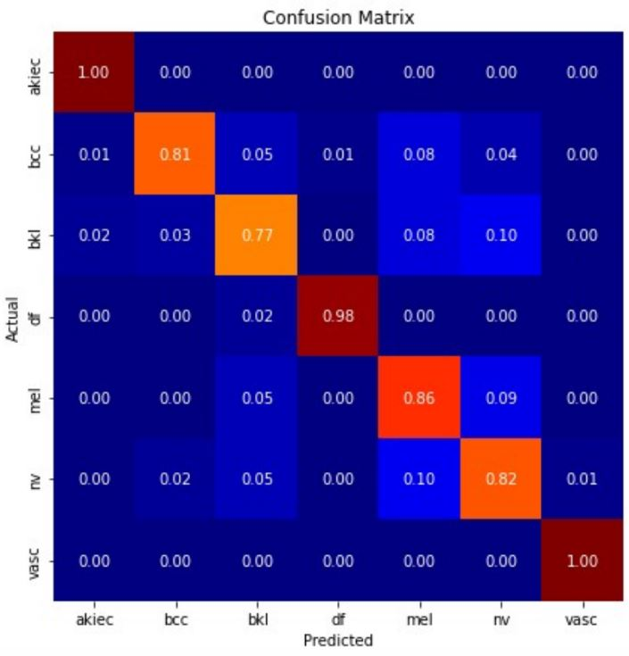
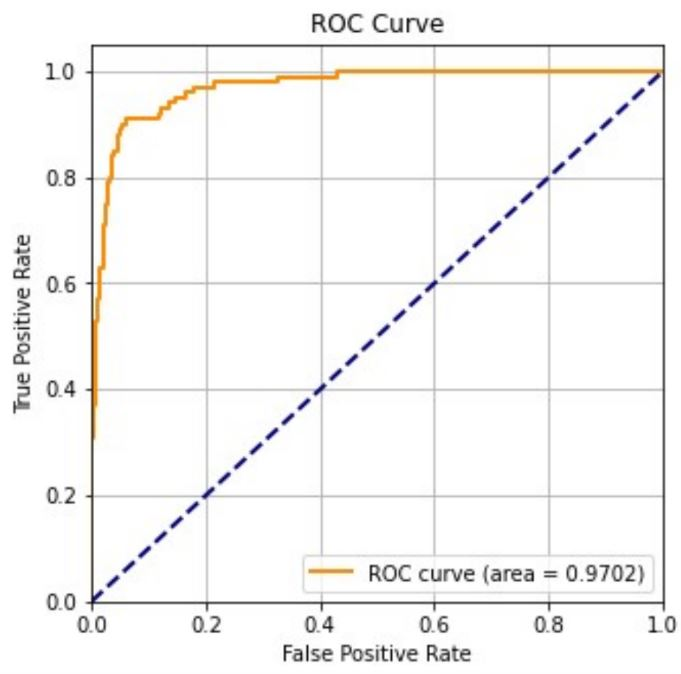

# Metrics

**Accuracy** measures the fraction of correctly classified data of both the positive and negative classes.
```
Accuracy = (TP+TN)/(TP+FP+FN+TN)
```

**Precision** is used to know the fraction of data that are actually of the positive class with respect to the total number of examples that the network has classified as positive.
```
Precision = (TP)/(TP+FP)
```

**Recall** measures how well the model does with the positive class data, in order to indentify not only the hits but also the mistekes.
```
Recall = (TP)/(TP+FN)
```

**AUC (Area Under ROC curve)** is used to evaluate the discriminative ability of a model, which is its capacity to distinguish positive and negative cases of a class.

**f1-score** is the harmonic mean between precision and recall, higher values indicate higher discriminative performance of the model.
```
f1-score = 2 * (Precision * Recall)/(Precision + Recall)
```

## Global results on test set

### Convolutional networks

**Xception**
|Stage  |Accuracy |Precision  |Recall 
|-------|-------  |-------    |------- 
|1      | 0.67    | 0.68      | 0.67    
|2      | 0.84    | 0.85      | 0.84 
|3      | 0.86    | 0.86      | 0.86 

**ResNet**
|Stage  |Accuracy |Precision  |Recall 
|-------|-------  |-------    |------- 
|1      | 0.70    | 0.72      | 0.70    
|2      | 0.79    | 0.81      | 0.79 
|3      | 0.79    | 0.80      | 0.79 

**MobileNet**
|Stage  |Accuracy |Precision  |Recall 
|-------|-------  |-------    |------- 
|1      | 0.69    | 0.72      | 0.69    
|2      | 0.72    | 0.75      | 0.72 
|3      | 0.69    | 0.73      | 0.69 

### Vision Transformers

**B-32**
|Stage  |Accuracy |Precision  |Recall 
|-------|-------  |-------    |------- 
|1      | 0.77    | 0.81      | 0.77    
|2      | 0.87    | 0.87      | 0.87 
|3      | 0.89    | 0.89      | 0.89 

**B-16**
|Stage  |Accuracy |Precision  |Recall 
|-------|-------  |-------    |------- 
|1      | 0.77    | 0.79      | 0.78    
|2      | 0.85    | 0.86      | 0.85 
|3      | 0.84    | 0.85      | 0.84 

**L-32**
|Stage  |Accuracy |Precision  |Recall 
|-------|-------  |-------    |------- 
|1      | 0.78    | 0.79      | 0.78    
|2      | 0.82    | 0.84      | 0.83 
|3      | 0.82    | 0.83      | 0.82 

### Comparision between best model of each architecture

|Model  |Accuracy |Precision  |Recall 
|-------|-------  |-------    |------- 
|B-32   | 0.89    | 0.89      | 0.89    
|Xception| 0.86    | 0.86      | 0.86 
|B-16   | 0.85    | 0.86      | 0.85
|L-32   | 0.82    | 0.84      | 0.83
|ResNet | 0.79    | 0.80      | 0.79
|MobileNet | 0.72    | 0.75      | 0.72

## Results ONLY in Melanoma class

|Model  |AUC      |f1-score   |Precision   |Recall 
|-------|-------  |-------    |-------     |------ 
|B-32   | 0.97    | 0.81      | 0.77       | 0.86    
|L-32   | 0.96    | 0.73      | 0.65       | 0.84
|B-16   | 0.96    | 0.72      | 0.65       | 0.80
|Xception| 0.96   | 0.71      | 0.71       | 0.72
|ResNet | 0.93    | 0.63      | 0.54       | 0.74
|MobileNet | 0.89 | 0.59      | 0.53       | 0.66

## Confusion Matrix and ROC curve of Best Model (ViT B-32)







