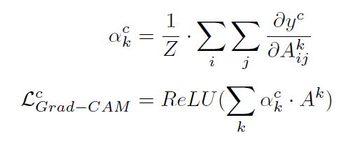
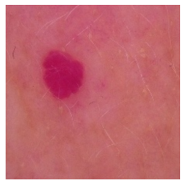
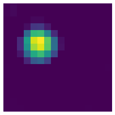
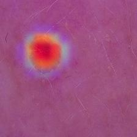
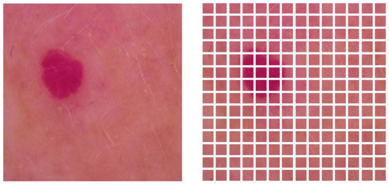
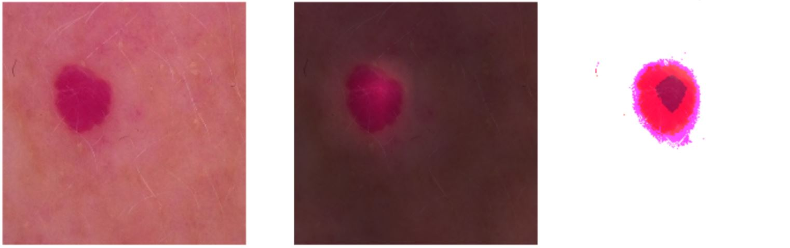

# eXplainable AI

As the outcome of many AI models are challenging to comprehend and trust due to their black-box nature, explainable AI (XAI) methods for improving trust in model’s decision-making has become a popular research subject in the field in recent years [1]. To evaluate our convolutional models results saliency maps and Grad-CAM algorithms were implemented. In the case of Vision Transformers, Attention Maps where extracted.

[1] S. Ali, T. Abuhmed, S. El-Sappagh, K. Muhammad, J. M. Alonso-Moral, R. Confalonieri, R. Guidotti, J. D. Ser, N. Díaz-Rodríguez, and F. Herrera, “Explainable artificial intelligence (xai):
What we know and what is left to attain trustworthy artificial intelligence,” Information Fusion, p. 101805, 2023. Available: https://www.sciencedirect.com/science/article/pii/S1566253523001148

# Saliency Maps

Saliency maps are a visualization technique used to help understand which parts of an input image are most important for the output produced by a Neural Network. It is important to note that the saliency maps are extracted from the trained model, so no additional annotation is required. The computation of the image-specific saliency map for a single class is extremely quick, since it only requires a single backpropagation pass. These maps are generated by computing the gradient of the output with respect to the input, which yields how changes in the input affect the output [2].


[2] K. Simonyan, A. Vedaldi, and A. Zisserman, “Deep inside convolutional networks: Visualising image classification models and saliency maps” arXiv preprint arXiv:1312.6034, 2013.

## Grad-CAM

The Gradient-weighted Class Activation Maps (Grad-CAM) generates a visual explanation from Convolutional Neural Networks without requiring architectural changes. In this technique, the gradient of an output (yc) is computed with respect to features maps of a convolutional layer (A), these gradients are global-average-pooled. The result is used to weight the feature maps, that after a ReLU activation produce a heatmap that shows wich regions of the image were most important for the model’s decision [3]. The following image shows the mathematical expression of the algorithm:



```
def get_img_array(img_path, size):
    # `img` is a PIL image of size 299x299
    img = keras.preprocessing.image.load_img(img_path, target_size=size)
    # `array` is a float32 Numpy array of shape (299, 299, 3)
    array = keras.preprocessing.image.img_to_array(img)
    # We add a dimension to transform our array into a "batch"
    # of size (1, 299, 299, 3)
    array = np.expand_dims(array, axis=0)
    return array


def make_gradcam_heatmap(img_array, model, pred_index=None):
    # First, we create a model that maps the input image to the activations
    # of the last conv layer as well as the output predictions
    grad_model = model

    # Then, we compute the gradient of the top predicted class for our input image
    # with respect to the activations of the last conv layer
    with tf.GradientTape() as tape:
        last_conv_layer_output, preds = grad_model(img_array)
        if pred_index is None:
            pred_index = tf.argmax(preds[0])
        class_channel = preds[:, pred_index]

    # This is the gradient of the output neuron (top predicted or chosen)
    # with regard to the output feature map of the last conv layer
    grads = tape.gradient(class_channel, last_conv_layer_output)

    # This is a vector where each entry is the mean intensity of the gradient
    # over a specific feature map channel
    pooled_grads = tf.reduce_mean(grads, axis=(0, 1, 2))

    # We multiply each channel in the feature map array
    # by "how important this channel is" with regard to the top predicted class
    # then sum all the channels to obtain the heatmap class activation
    last_conv_layer_output = last_conv_layer_output[0]
    heatmap = last_conv_layer_output @ pooled_grads[..., tf.newaxis]
    heatmap = tf.squeeze(heatmap)

    # For visualization purpose, we will also normalize the heatmap between 0 & 1
    heatmap = tf.maximum(heatmap, 0) / tf.math.reduce_max(heatmap)
    return heatmap.numpy()

# BUILD THE MODEL WITH THE SEQUENTIAL API TO EXTRACT LAYERS EASILY
m = tf.keras.applications.Xception(input_shape=(512,512,3), include_top=False, weights='imagenet')

inputs = tf.keras.Input(shape = (512,512,3))
x1 = m(inputs)
x = tf.keras.layers.GlobalAveragePooling2D()(x1)
x = tf.keras.layers.Dense(128, activation='relu', kernel_initializer='he_uniform')(x)
x = tf.keras.layers.Dropout(0.2)(x)
x = tf.keras.layers.Dense(64, activation='relu', kernel_initializer='he_uniform')(x)
x = tf.keras.layers.Dropout(0.1)(x)
x = tf.keras.layers.Dense(32, activation='relu', kernel_initializer='he_uniform')(x)
x = tf.keras.layers.Dropout(0.1)(x)
out = tf.keras.layers.Dense(7, activation='softmax')(x)
model_2 = tf.keras.models.Model(inputs = inputs, outputs = [x1, out])

model = tf.keras.models.load_model("C:\\Users\\faricardo\\Downloads\\Xcep3.h5")
pesos = model.get_weights()

model_2.set_weights(pesos)

heatmap = make_gradcam_heatmap(image, model_2)

def display_gradcam(img_path, heatmap alpha=0.4):
    # Load the original image
    img = keras.preprocessing.image.load_img(img_path)
    img = keras.preprocessing.image.img_to_array(img)

    # Rescale heatmap to a range 0-255
    heatmap = np.uint8(255 * heatmap)

    # Use jet colormap to colorize heatmap
    jet = cm.get_cmap("jet")

    # Use RGB values of the colormap
    jet_colors = jet(np.arange(256))[:, :3]
    jet_heatmap = jet_colors[heatmap]

    # Create an image with RGB colorized heatmap
    jet_heatmap = keras.preprocessing.image.array_to_img(jet_heatmap)
    jet_heatmap = jet_heatmap.resize((img.shape[1], img.shape[0]))
    jet_heatmap = keras.preprocessing.image.img_to_array(jet_heatmap)

    # Superimpose the heatmap on original image
    superimposed_img = jet_heatmap * alpha + img
    superimposed_img = keras.preprocessing.image.array_to_img(superimposed_img)

    plt.imshow(superimposed_img)

display_gradcam(paths[i], heatmaps[i], names[i])
```

<figcaption>Original image<figcaption>


<figcaption>GradCam<figcaption>


<figcaption>Composition<figcaption>



[3] R. R. Selvaraju, A. Das, R. Vedantam, M. Cogswell, D. Parikh, and D. Batra, “Grad-cam: Why did you say that?” Nov. 2016.

## Attention Maps

Attention maps in Vision Transformers provide a visual representation of how the model distributes its attention within an image. These maps reveal which regions are relevant to the task at hand, which helps to understand how the model is processing and analyzing visual information [4].

The following image shows the result of the patch embedding of the model on an image:



The following images shows the result of the attention mechanism of the best model on an image, the image in the right is the composition of the original and the attention map, excluding similar pixels:



The code to obtain the attention map and create the composition is the following:

```
from vit_keras import visualize
from tensorflow.keras.preprocessing import image

'''
* vit_keras: is installable with pip
* vit_model_t: is the trained model (ViT-B32 + Classification layers) loaded previously
* is important to use get_layer to extract only the Vision Transformer from the complete model
* original image and attention map are compared and the similar intensity pixels are turned to zero, to show only the differences
'''

path='PATH TO THE IMAGE'
img = cv2.imread(path)
img = cv2.cvtColor(img, cv2.COLOR_BGR2RGB)
res = cv2.resize(img, dsize=(224,224), interpolation=cv2.INTER_CUBIC)
copia = cv2.resize(img, dsize=(224,224), interpolation=cv2.INTER_CUBIC) 

attention_map = visualize.attention_map(model = vit_model_t.get_layer('vit-b32'), image = res)

for f in range(len(img[0])):
  for c in range(len(img[1])):
    for l in range(3):
      if (res[f][c][l] > (attention_map[f][c][l] - 40)) and (res[f][c][l] < (attention_map[f][c][l] + 40)):
        continue
      else:
        copia[f][c][l] = 255

# Plot results
fig = plt.figure(figsize=(20,20))

ax = plt.subplot(1, 3, 1)
ax.axis('off')
ax.set_title('Original')
_ = ax.imshow(res)

ax = plt.subplot(1, 3, 2)
ax.axis('off')
ax.set_title('Attention Map')
_ = ax.imshow(attention_map)

ax = plt.subplot(1, 3, 3)
ax.axis('off')
ax.set_title('Relevant pixels')
_ = ax.imshow(copia)

```


[4] Dosovitskiy, A., Beyer, L., Kolesnikov, A., Weissenborn, D., Zhai, X., Unterthiner, T., & Houlsby, N. (2020). "An image is worth 16x16 words: Transformers for image recognition at scale." arXiv preprint arXiv:2010.11929.


